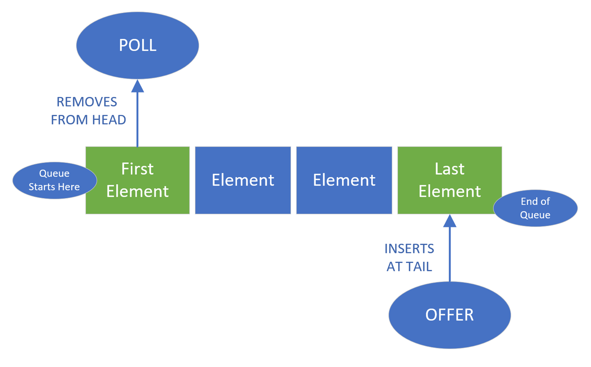
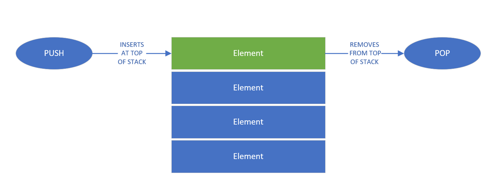
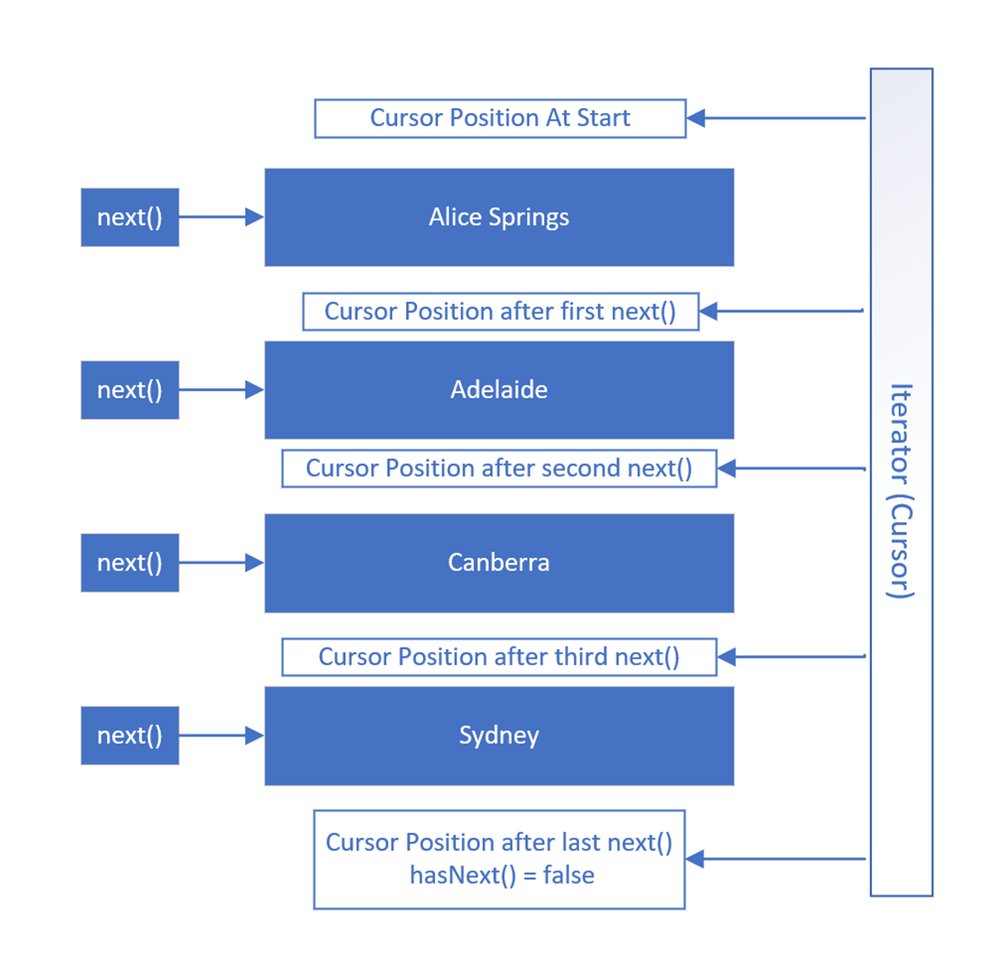
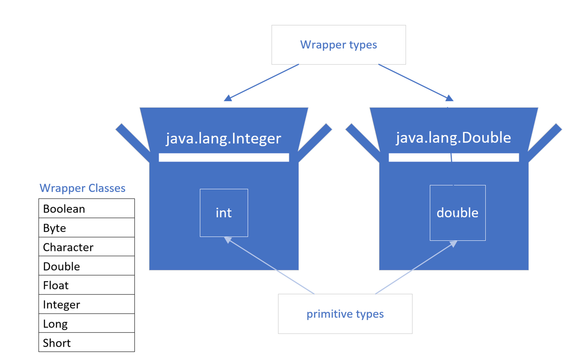

# Proyecto JAVA master fulfillment course

# ¿Que son las Clases?
Las clases son templates para la creacion de objetos
un objeto es la instacia de una clase (an object is create by instantiating a class)
instancia y objeto son terminos interchangeable

# ¿Static field?
Cuando un valor es estatico se almacena en un lugar especial de la memoria, los valores son accesibles sin necesidad
de instanciar la clase.

# Static method vs Instance method
- los metodos estaticos se pueden acceder sin instanciar la clase
- los metodos instanciados solo se pueden acceder una vez se haya creado un objeto de esa clase.

# Java Array vs Java List

Un array es mutable, podemos establecer o cambiar valores en el array, pero no podemos cambiar su tamaño.

Java nos brinda varias clases que nos permiten agregar y eliminar elementos y cambiar el tamaño de una secuencia de elementos.
Se dice que estas clases implementan un **comportamiento de lista**.

> List es un tipo especial en Java, llamado Interfaz.
Una interfaz de list describe un conjunto de firmas de métodos que se espera que tengan todas las clases de list.

ArrayList es una clase que realmente mantiene un array en la memoria, que en realidad es más grande de lo que necesitamos, en la mayoría de los casos.

Realiza un seguimiento de la capacidad, que es el tamaño real del array en la memoria.

Pero también realiza un seguimiento de los elementos que se han asignado o configurado, que es del tamaño de ArrayList.

A medida que se agregan elementos a una ArrayList, es posible que su capacidad deba crecer. Todo esto sucede automáticamente, detrás de escena.
Esta es la razón por la cual ArrayList es redimensionable.

# Java Linked List

Un lista enlazada es una lista en donde todos sus componentes estan enlazados directamente con su antecesor y con su predecesor, es por ello que puede aplicar con cola o como pila, a diferencia del arrayList que generalmente aplica como Array. La lista enlazada asi como los ArrayList utilizan la misma interfaz de list.

Las colas son colecciones de data de tipo FIFO, utilizan procesos especiales y aplicables cuando se trabaje el linked List como cola, poll <- Elimina desde el inicio de la cola y offer <- Ingresa al final de la cola. Adicionalmente las colas pueden ser singled-ended cuando solo se gestionan los ingresos de data al final y la extracción desde el inicio, y pueden ser double-ended, permite el ingreso y la extracción de datos desde ambos extremos. 

Las pilas son colecciones de data de tipo LIFO, es una representación vertical de datos que solo permite el acceso de la data desde la parte superior de la misma, utilizan al igual que las colas procesos especiales y aplicables al momento de que logicamente se utilice la Linked List como pila, pop <- para extraer data de la pila y push <- para insertar data a la pila.

# Iteradores y Iteradores de Lista (Iterators & ListIterators)

Los iteradores (iterators) son objetos que nos entrega JAVA para poder recorrer las listas, este ojeto viene en la interfaz de List, cuando se instancia, lo que nos permite, es mediante funciones internas recorrer las listas y o colecciones como las haria un cursor de BBDD, internamente al momento de declarar el iterador, este se posiciona antes del index 0 de la lista y obtiene la información contenida en la siguiente posicion de la lista mediante la funcion next(), para poder recorrer las listas se utiliza un loop While y este opera mediante la funcion hasNext(), esta funcion retorna un booleano y sera verdadero mientras en la lista se encuentre un siguiente elemento al cual moverse.

El iterador siempre se mueve entre las posiciones de una lista / coleccion.

Adicional a la posibilidad de recorrer nuestra lista tambien podemos eliminar elementos mediante el proceso `remove()`, podemos agregar un nuevo elemento mediante el proceso `add()` y finalmente podemos editar un elemento mediante el proceso `set()`

# Boxing (Autoboxing y unboxing)

El boxing es la manera en que JAVA habilita el uso e interacción de objetos y clases con los tipos de datos primitivos.

Datos primitivos:
byte
short
int
long
float
double
boolean
char

Para poder generar por ejemplo un ArrayList de datos enteros, JAVA no permite que se pueda generar a partir de la definicion primitiva (int) Ejemplo: ArrayList<int> misEnteros = new ArrayList<>(); <- este ejemplo nos generaria un error de compilación, ya que la clase ArrayList no soporta tipos de datos primitivos como tipos de colección.

Es por ello que JAVA nos proporciona clases tipo wrapper para todos los tipos de datos primitivos, cuando establecemos el valor de un dato primitivo a la implementacion de estas clases wrapper, a ese proceso se le llama boxing, y cuando se requeire el valor primitivo desde implementacion se le llama unboxing.

# Clases abstractas

# Interfaces

# Clases Abstractas vs Interfaces